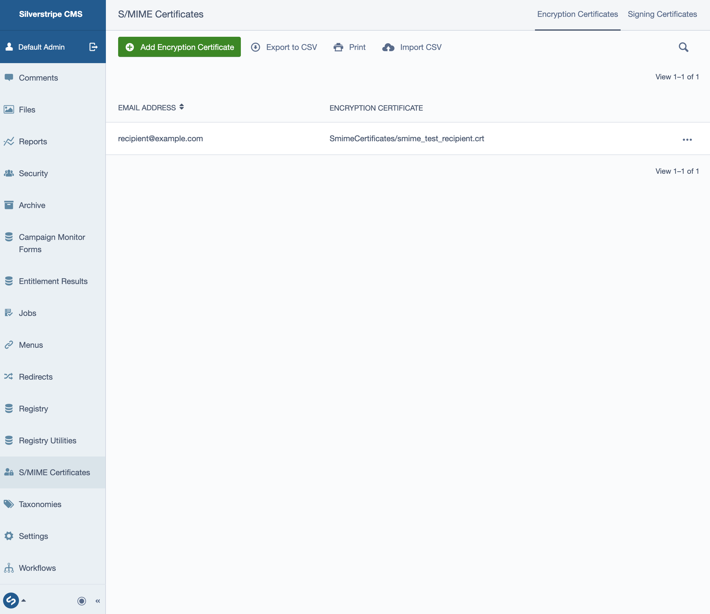

# SilverStripe SMIME Forms

This module provides an extension to [Silverstripe Elemental User Forms](https://github.com/dnadesign/silverstripe-elemental-userforms)
that allows you to choose whether or not the emails for form submissions should be encrypted and/or digitally signed, for added security.

It uses S/MIME encryption.

## Requirements

* SilverStripe ^5
* SilverStripe Elemental Forms

## Installation
To start using this module, just add it as a dependency to your project.

```
composer require silverstripeltd/user-configurable-smime-forms
```

## License
See [License](license.md)

## Documentation
When configuring user forms within the CMS you can specify whether the submitted form data is emailed to a list of Recipients.

This module provides an additional option to encrypt the email. This is
specifically useful when you are sending emails to known recipients, and requires the recipient's encryption
certificate (.crt file). This module adds an admin section (ModelAdmin) for managing and uploading S/MIME certificates for the purpose of encryption and digital signing of emails.

### Enable Encryption of Emails
To enable encryption, go to the **Configuration** tab for your form and check the **Enable S/MIME Encryption** option. With this option set when a form submission is sent to a recipient the system will check for an uploaded encryption certificate for that user. Note: If one does not yet exist the email will be sent unencrypted with a warning (**UNENCRYPTED: CHECK CMS CONFIGURATION**) added to the email subject.


### Managing S/MIME Certificates
This module adds an S/MIME Certificates ModelAdmin to the CMS left hand menu for managing encryption and signing certificates and by default it is available to administrators with full access rights.

To provide specific CMS groups (e.g., IT administrator users) with the ability to manage these certificates, you can add the `Manage S/MIME certificates` permission to their permissions group in the Security section of the CMS.



### Adding recipient encryption certificates
To add encryption certificates to the CMS:
* Log into the CMS as an administrator or user/group with the **Manage S/MIME certificates** permission
* From the CMS left hand menu select **S/MIME Certificates**
* The default view shows a grid view of uploaded encryption certificates.
* Click on **Add Encryption Certificate**
* Enter a valid **Email address**
* Upload a valid `.crt` file to the **Encryption Certificate** field
* Click **Create**


### Adding sender certificates for digitally signing emails
This module supports digital signing of emails, which provides further assurance for the recipient of where the email comes from.

To sign an email you need both the certificate .pem and private key .pem files. To upload these into the CMS:
* Log into the CMS as an administrator or user/group with the **Manage S/MIME certificates** permission
* From the CMS left hand menu select **S/MIME Certificates**
* Select the **Signing Certificates** tab
* Click on **Add Signing Certificate**
* Enter a valid **Email address**
* Upload a valid `.pem` file containing the certificate to the **Signing Certificate** field
* Upload a valid `.pem` file containing the private key to the **Signing Key** field
* Enter the passphrase for the `.pem` file (this will not be shown and will be stored in an encrypted format)
* Click **Create**

## Maintainers
 * Andrew Dunn <andrew.dunn@silverstripe.com>
 * Paul Jayme <pjayme@silverstripe.com>

## Bugtracker
Bugs are tracked in the issues section of this repository. Before submitting an issue please read over
existing issues to ensure yours is unique.

If the issue does look like a new bug:

 - Create a new issue
 - Describe the steps required to reproduce your issue, and the expected outcome. Unit tests, screenshots
 and screencasts can help here.
 - Describe your environment as detailed as possible: SilverStripe version, Browser, PHP version,
 Operating System, any installed SilverStripe modules.

Please report security issues to the module maintainers directly. Please don't file security issues in the bugtracker.

## Development and contribution
If you would like to make contributions to the module please ensure you raise a pull request and discuss with the module maintainers.
