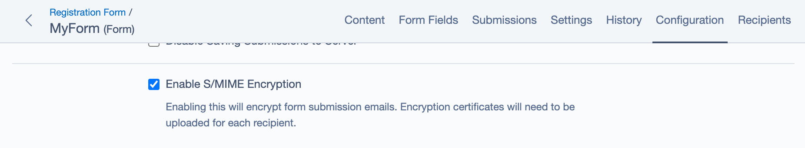
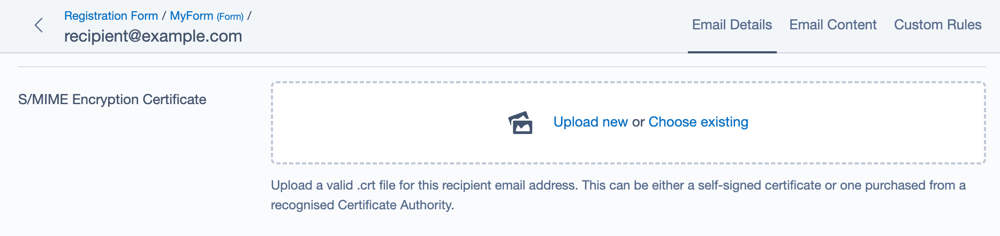

# SilverStripe SMIME Forms

This module provides an extension to [Silverstripe Elemental User Forms](https://github.com/dnadesign/silverstripe-elemental-userforms)
that allows you to choose whether or not the emails for form submissions should be encrypted and/or digitally signed, for added security.

It uses S/MIME encryption.

## Requirements

* SilverStripe ^4.0
* SilverStripe Elemental Forms
* SilverStripe S/Mime

## Installation
To start using this module, just add it as a dependency to your project.

```
composer require silverstripe/smime-forms
```

## License
See [License](license.md)

We have included a 3-clause BSD license you can use as a default. We advocate for the BSD license as
it is one of the most permissive and open licenses.

Feel free to alter the [license.md](license.md) to suit if you wan to use an alternative license.
You can use [choosealicense.com](http://choosealicense.com) to help pick a suitable license for your project.

## Documentation
When designing your elemental form you can choose whether encryption is required. This is
specifically useful when you are sending emails to known recipients, and requires the recipient's encryption
certificate (.crt file) containing their public encryption key for encrypting.

### Optional Digital Signing of Emails
This module also supports digital signing of emails, which provides further assurance for the recipient of where the email comes from.

To sign an email you need both the .crt and private .key files. These can be added to a path on the server and set with the following environmental variables:

`SS_SMIME_SIGN_CERT` The signing certificate for the sender of the email.
`SS_SMIME_SIGN_KEY` The private key that goes with the signing certificate.
`SS_SMIME_SIGN_PASS` The signing password (if the certificate has been set up with additional password security).

### Enable Encryption of Emails
To enable encryption, go to the **Configuration** tab for your form and check the Use **Enable S/MIME Encryption** option.



### Adding recipient encryption certificate
With encryption enabled you get can upload an encryption certificate
when adding recipients. To do this:
* Go to the **Recipients** tab for your form
* Add/Edit Recipient
* Click on the **Email Content** tab
* Upload a valid CRT file to the **Certificate for SMIME encryption** field



## Maintainers
 * Andrew Dunn <andrew.dunn@silverstripe.com>

## Bugtracker
Bugs are tracked in the issues section of this repository. Before submitting an issue please read over
existing issues to ensure yours is unique.

If the issue does look like a new bug:

 - Create a new issue
 - Describe the steps required to reproduce your issue, and the expected outcome. Unit tests, screenshots
 and screencasts can help here.
 - Describe your environment as detailed as possible: SilverStripe version, Browser, PHP version,
 Operating System, any installed SilverStripe modules.

Please report security issues to the module maintainers directly. Please don't file security issues in the bugtracker.

## Development and contribution
If you would like to make contributions to the module please ensure you raise a pull request and discuss with the module maintainers.
